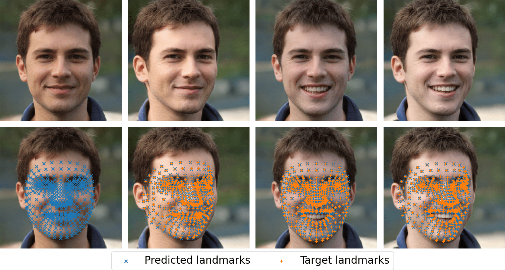
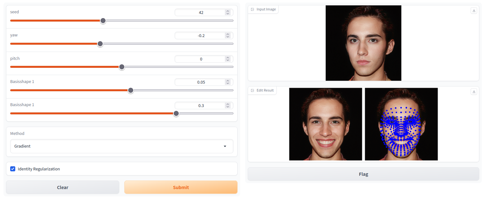

# Controllable GAN Synthesis Using Non-Rigid Structure-from-Motion (CVPRW 2023)

[](https://www.python.org/downloads/release/python-38/)
[](https://pytorch.org/)


[Project page](http://itu.dk/~renha/rankonegan/docs/) |
[Paper](https://arxiv.org/abs/2211.07195) |
[Poster](docs/resources/poster.pdf) |
[Demo](demo.ipynb) 

> René Haas and Stella Graßhof and Sami S. Brandt  
> 
> In this paper, we present an approach for combining non-rigid structure-from-motion (NRSfM) with deep generative models, and propose an efficient framework for discovering trajectories in the latent space of 2D GANs corresponding to changes in 3D geometry. Our approach uses recent advances in NRSfM and enables editing of the camera and non-rigid shape information associated with the latent codes without needing to retrain the generator. This formulation provides an implicit dense 3D reconstruction as it enables the image synthesis of novel shapes from arbitrary view angles and non-rigid structure. The method is built upon a sparse backbone, where a neural regressor is first trained to regress parameters describing the cameras and sparse non-rigid structure directly from the latent codes. The latent trajectories associated with changes in the camera and structure parameters are then identified by estimating the local inverse of the regressor in the neighborhood of a given latent code. The experiments show that our approach provides a versatile, systematic way to model, analyze, and edit the geometry and non-rigid structures of faces. 



# Setup

```
conda env create -f environment/rankone_env.yml
```

## Usage


## Interactive demo
Try our interactive demo [here](demo.ipynb)



# Acknowledgements

This repository borrows code from the awesome work in 
- [Third Time's the Charm? Image and Video Editing with StyleGAN3 (AIM Workshop ECCV 2022)](https://github.com/yuval-alaluf/stylegan3-editing)
- [Designing an Encoder for StyleGAN Image Manipulation (SIGGRAPH 2021)](https://github.com/omertov/encoder4editing) 
- [HyperStyle: StyleGAN Inversion with HyperNetworks for Real Image Editing (CVPR 2022)](https://github.com/yuval-alaluf/hyperstyle)

## Citation
If you use this code for your research, please cite our paper:
```
@misc{haas2022controllable,
      title={Controllable GAN Synthesis Using Non-Rigid Structure-from-Motion}, 
      author={René Haas and Stella Graßhof and Sami S. Brandt},
      year={2022},
      eprint={2211.07195},
      archivePrefix={arXiv},
      primaryClass={cs.CV}
}
```
